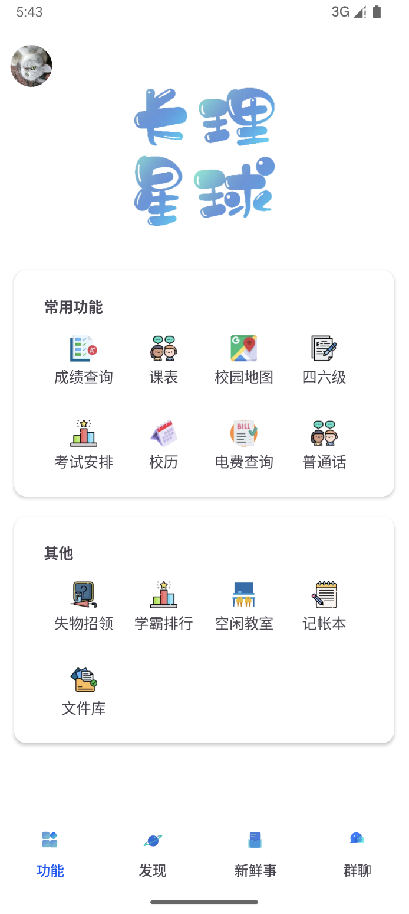
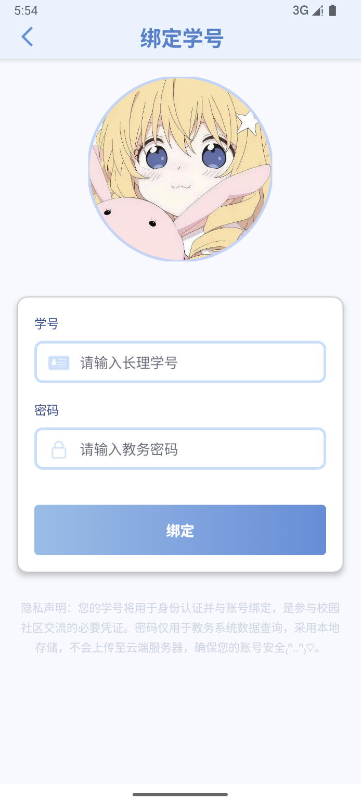
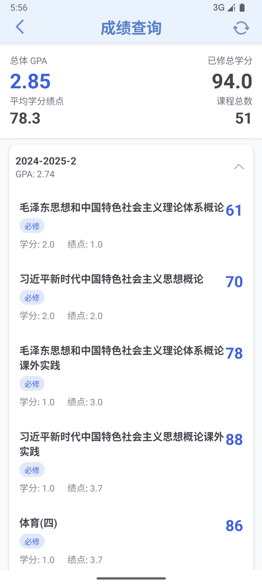
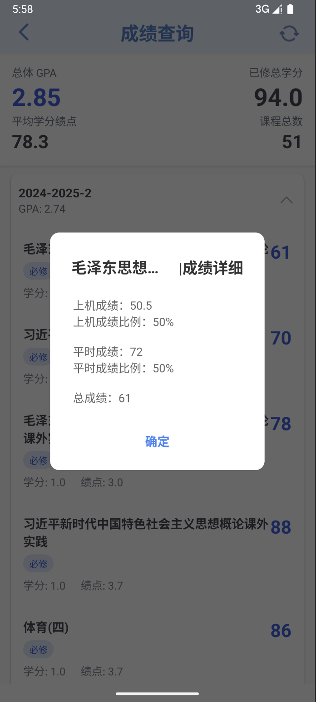
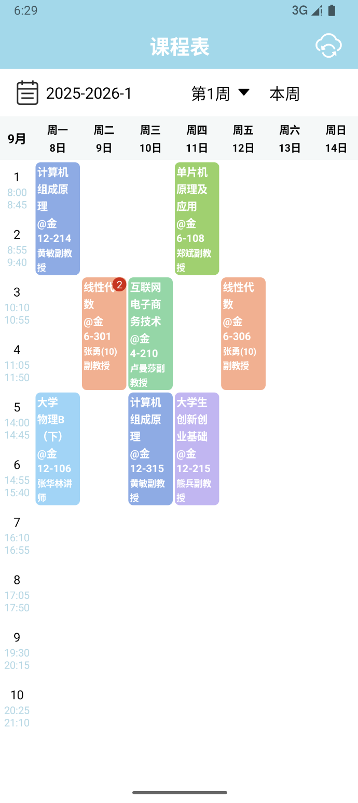
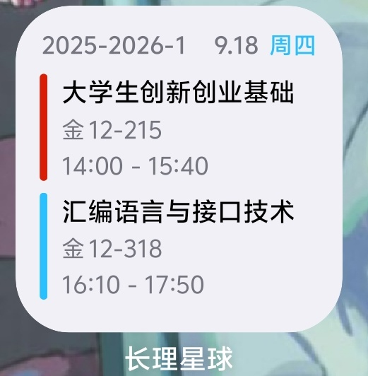

长理星球，作为开源的轻量化校园工具APP，安全性高，性能出色，具有课表查询，课表小组件，成绩，考试安排等常用功能

## 主要功能

### 功能页面

- 绑定教务系统后，可使用教务系统相关功能，例如查询课表，成绩或考试安排
- 在不登录的情况下，也可以进行空闲教室，电费查询等功能

|  |  |
| :----------------------------------------------------------: | :----------------------------------------------------------: |

### 成绩查询

> 数据由教务系统提供，此类数据都只会保存在本地，不会上传云端

|  |  |
| :----------------------------------------------------------: | :----------------------------------------------------------: |

### 课表查询

> 进入课表可以查看最新课表，自动存储到本地，定时刷新，在没有网络的环境下也能查看数据~

|  |  |
| :----------------------------------------------------------: | :----------------------------------------------------------: |

### 考试安排

> 在教务系统颁布考试时间后便可查看

### 其他功能

> 可自行探索

## 下载

长理星球目前支持 Android, IOS平台

通常建议使用稳定版本. 如果你愿意参与测试并拥有一定的对 bug 的处理能力, 也欢迎使用测试版本更快体验新功能.
具体版本类型可查看下方.

## 参与开发

目前长理星球项目里缺少后端，前端，产品，美工等开发人员，如果你有兴趣，可联系加入我们

欢迎你提交 PR 参与开发，
有关项目技术细节请参考 [CONTRIBUTING](docs/contribution/分支规范.md)

## 提供意见

欢迎使用长理星球的时候留下你宝贵的意见

## FAQ

### 在长理星球中输入自己的学生账号与密码是否有泄露的风险

并不会，每个账号可以绑定学号并上传云端，但是密码会保存到本地，长理星球前后端移动代码都是开源的，公开透明，安全性高

### 如何加入

长理星球加入表单链接https://creamaker.feishu.cn/share/base/form/shrcnOIl2W9rBAcEYYrK12l6Ffd

