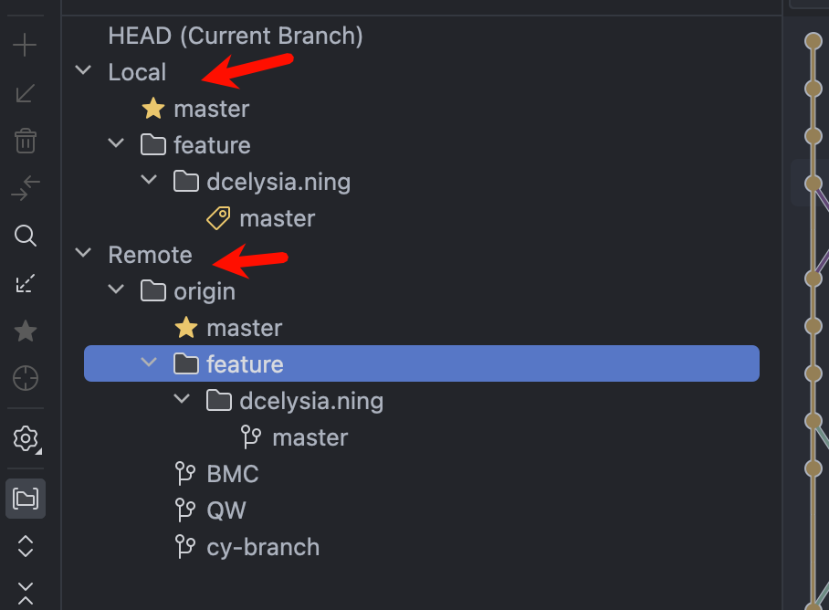
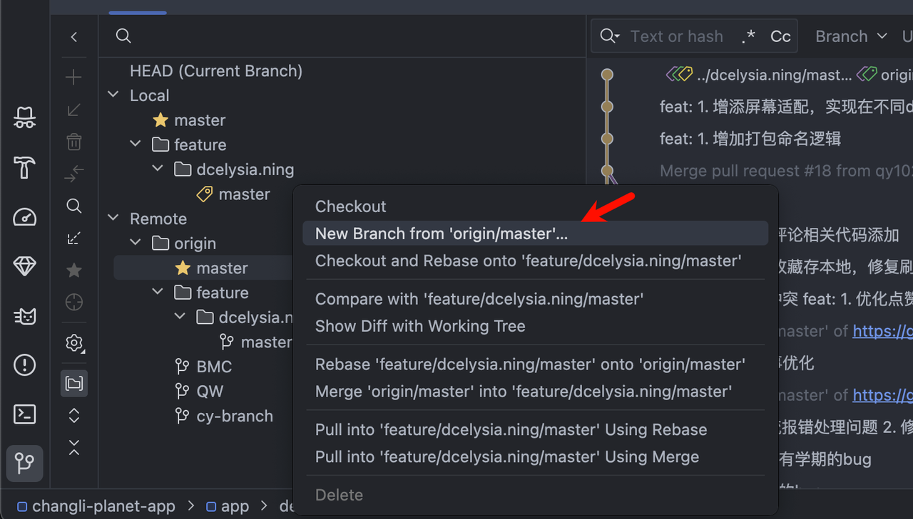
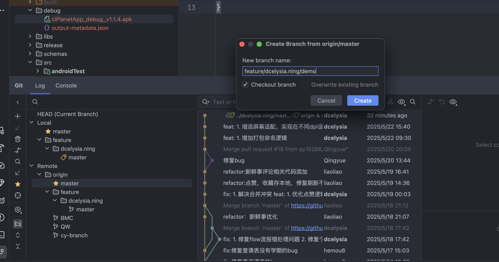
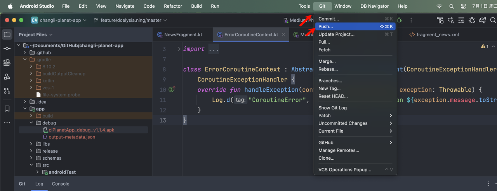
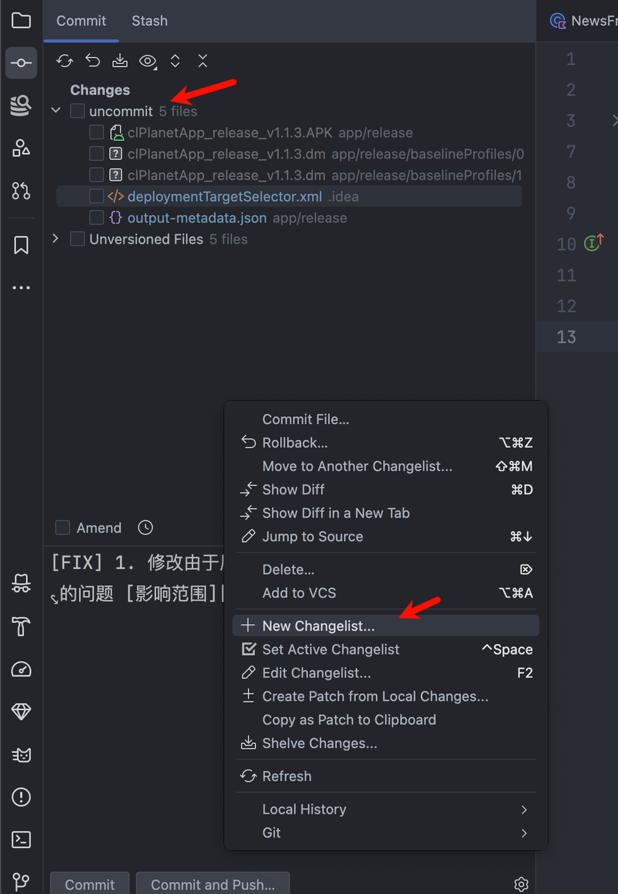
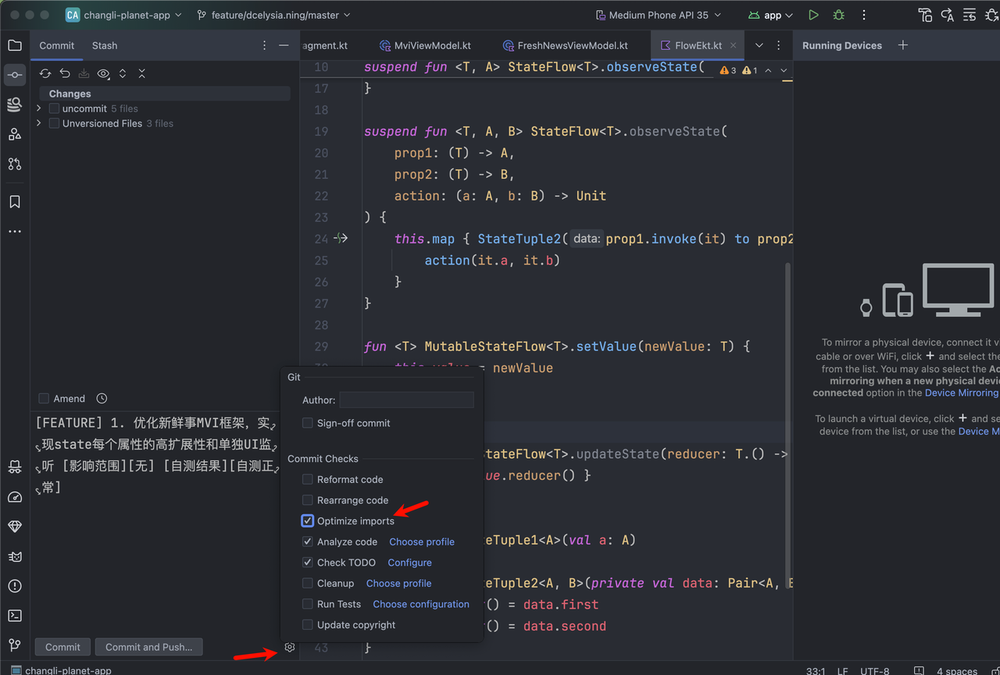

# Jetbrains的Git技巧

长理星球由于仓库在github，所以在拉取代码，新建分支以及push操作和提MR时候请保证网络通畅

为了提高git的可维护性，之后分支开发不应直接push到master分支，研发人员应该新建分支点到例如feature文件夹下进行开发，在开发完成后提MR后合并入master主分支，合入主分支请在群里发送MR链接并@老东西们review

## 新建分支

在AS中（其他全家桶应该同理），可以分为Local（本地）分支和 Remote（远程）分支

如果是新建开发分支可以在Remote中选择你需要的分支右键，选择New Branch from 'XXXX'，这里以master为例

然后输入名字，文件夹用\分隔

创建完成后，在全家桶最上面有Git，然后点击push将新建的分支推送到Remote上，之后你的分支就推送到云端，并在Github见面可以新建MR请求了

同理在上图页面，点击pull并输入你需要拉下来的代码分支，可以拉取那个分支的最新代码并合并到你当前的分支，**每次开发前请合并master分支避免代码过时**

**在研发的时候，只格式化自己书写的代码，不能直接全局格式化增大review难度，在commit时候不能代上编译器自动生成的文件，例如.idea应该在commit页面New Changelist，并将不需要提交的代码放到里面，并在commit的时候取消勾选该文件夹，如下图**

 并且打开编译器的Optimize imports设置，之后commit中无用的import将自动不会被提交

commit时候的描述模板可简可全面，但请记住描述是他人用来了解你本次提交的作用，请务必**描述清晰明了**。

**在commit之前建议大家都跑一下确保能自测成功再提交，勿自大**