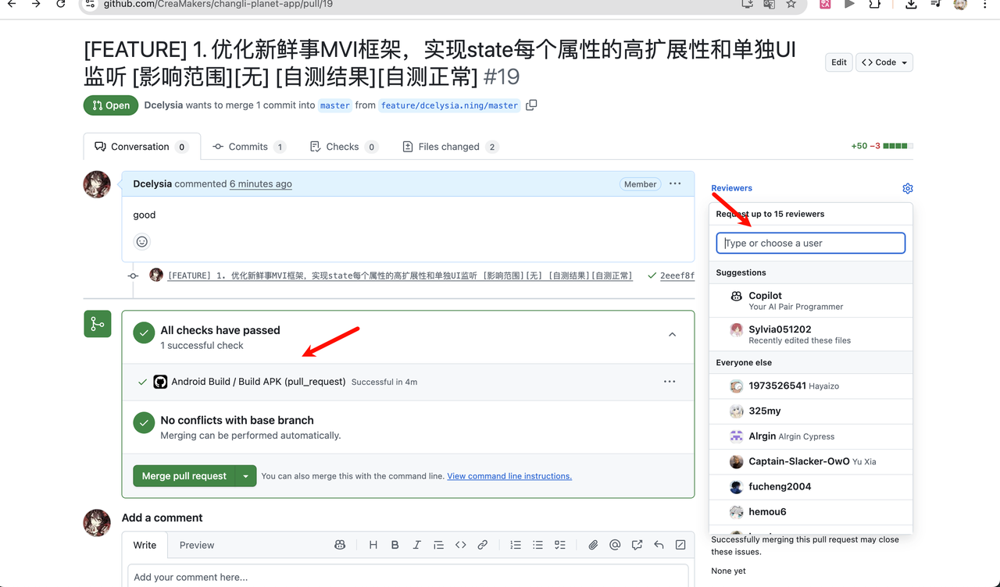

# 分支规范

| 分支名   | 生命周期     | 管理人           | 备注                                   |
| -------- | ------------ | ---------------- | -------------------------------------- |
| master   | 永久         | @群里 移动端人员 | 用于打包release包，编译主包分支        |
| feature  | 研发自己决定 | 研发自己         | 增加新需求、功能或代码重构，分支可删除 |
| bugfix   | 研发自己决定 | 研发自己         | bug修复                                |
| ui       | 研发自己决定 | 研发自己         | ui修改                                 |
| optimize | 研发自己决定 | 研发自己         | 技术优化                               |
| tea      | 研发自己决定 | 研发自己         | 埋点                                   |

请在github提交MR之前一定自测编译能通过再合入master，要求保证master的分支一定不能被投毒，注意看提master的MR的时候pipeline是否能通过，若不能通过则直接被拒绝。可选择reviewer或者在群里@你中意的老东西们

